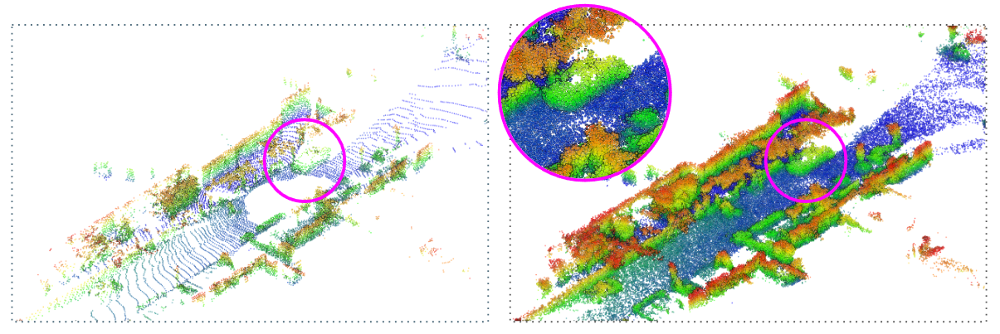
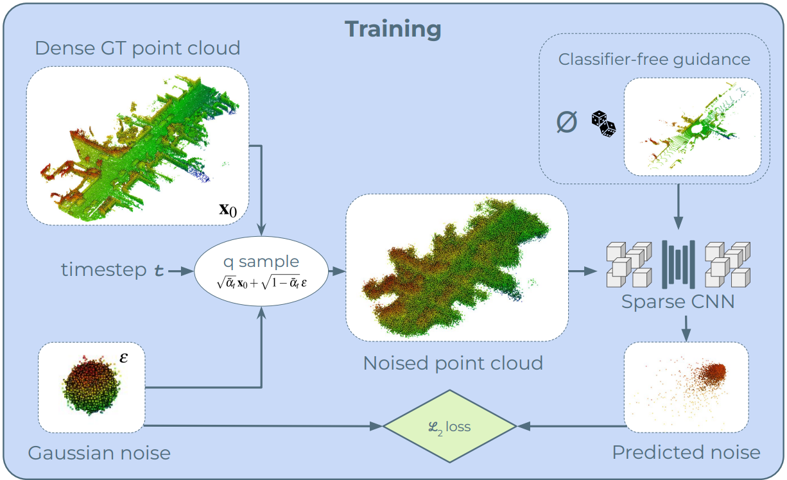
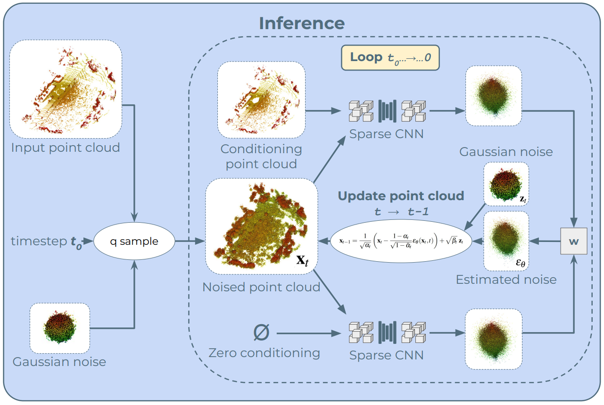

<div align="center">

# LiDPM: Rethinking Point Diffusion for Lidar Scene Completion

[](https://arxiv.org/abs/2504.17791)
[](https://ieee-iv.org/2025/)
[](https://astra-vision.github.io/LiDPM/)

</div>

<p align="center">
  
</p>

This is the official repository for the paper

```
LiDPM: Rethinking Point Diffusion for Lidar Scene Completion
Tetiana Martyniuk, Gilles Puy, Alexandre Boulch, Renaud Marlet, Raoul de Charette
IEEE IV 2025
```

**Updates:**

- 15/07/2025: SemanticKITTI validation set results updated (see [Evaluation](#evaluation)).
- 10/07/2025: inference scripts updated.
- 25/06/2025: training and inference code released.

## Table of Contents

- [Installation](#installation)
- [SemanticKITTI Dataset](#semantickitti-dataset)
- [Ground truth generation](#ground-truth-generation)
- [Training the model](#training-the-model)
- [Model Weights](#model-weights)
- [Inference](#inference)
- [Evaluation](#evaluation)
- [Citation](#citation)
- [License](#license)
- [Acknowledgments](#acknowledgments)

## Installation

The code uses **Python 3.7**.

#### Create a Conda virtual environment:

```bash
conda create --name lidpm python=3.7
conda activate lidpm
```

#### Clone the project and install requirements:

```bash
git clone https://github.com/astra-vision/LiDPM
cd LiDPM

sudo apt install build-essential libopenblas-dev
pip install -r requirements.txt

# Install Minkowski Engine
export TORCH_NVCC_FLAGS="-Xfatbin -compress-all"
pip install -U git+https://github.com/NVIDIA/MinkowskiEngine --install-option="--blas=openblas" --install-option="--force_cuda" -v --no-deps
```

## SemanticKITTI Dataset

The SemanticKITTI dataset has to be downloaded from the
official [webpage](http://www.semantic-kitti.org/dataset.html#download) and extracted in the following structure:

```
SemanticKITTI
    └── dataset
        └── sequences
            ├── 00/
            │   ├── velodyne/
            |   |       ├── 000000.bin
            |   |       ├── 000001.bin
            |   |       └── ...
            │   └── labels/
            |       ├── 000000.label
            |       ├── 000001.label
            |       └── ...
            ├── ...
            ├── 08/ # for validation
            ├── ...
            ├── 11/ # 11-21 for testing
            ├── ...
            └── 21/
                └── ...
```

## Ground truth generation

To generate the complete scenes, run the `map_from_scans.py` script.
This uses the dataset scans and poses to generate sequence maps, which serve as ground truth during training.

Specify the SemanticKITTI path and the output path in the corresponding config file.

```
cd lidpm/scripts
python map_from_scans.py configs/map_from_scans.yaml
```

## Training the model

<p align="center">
  
</p>

To train the diffusion model, the configurations are defined in `config/train.yaml`, and the training can be started
with:

```
cd lidpm
python train.py --config config/train.yaml
```

Don't forget to specify the `data_dir` and `gt_map_dir` in the config file.

The model was trained on 4 NVIDIA A100 GPUs for 40 epochs.

## Model Weights

The pre-trained model checkpoint can be downloaded from
the [GitHub release](https://github.com/astra-vision/LiDPM/releases/tag/v1.0-weights).

## Inference

<p align="center">
  
</p>

To complete the lidar scans, run

```
cd lidpm/scripts
python inference.py configs/inference.yaml
```

In the corresponding config you should specify the path to the diffusion checkpoint, dataset path, and output folder,
and decide if you want to run inference on a particular sequence or over the list of predefined pointclouds
(configured in `canonical_minival_filename`).

#### DPM-Solver

In order to speed up inference, we follow [LiDiff](https://github.com/PRBonn/LiDiff/tree/main) and
employ [DPM-Solver](https://arxiv.org/abs/2206.00927).
To complete the lidar scans using DPM-Solver, run

```
cd lidpm/scripts
python inference_dpmSolver.py configs/inference_dpmSolver.yaml
```

The number of DPM-Solver steps is configured via `denoising_steps`, and the corresponding number of diffusion steps is
set via `starting_point`.
For insights into these parameters, refer to Table 2 ("Ablation studies") in the paper.
By default, we use `denoising_steps=20` and `starting_point=300`, as suggested by our ablation.

## Evaluation

For evaluation on SemanticKITTI, we follow the protocol from [LiDiff](https://github.com/PRBonn/LiDiff/blob/main/lidiff/utils/eval_path.py).
The results are obtained using the LiDPM model checkpoint (see [Model Weights](#model-weights)) and DPM-Solver inference (20 steps).
To report "LiDPM (refined)" results, we use the off-the-shelf [LiDiff refinement network](https://github.com/PRBonn/LiDiff?tab=readme-ov-file#trained-model).

### Updated Table 1 (SemanticKITTI validation set)

Below are the evaluation results on the SemanticKITTI validation set, based on the [updated LiDiff metrics code](https://github.com/PRBonn/LiDiff/commit/e5305f93d1d9d9ad09fc033a6dc3408e061401c3) and incorporating [the revised values](https://github.com/PRBonn/LiDiff/issues/45#issuecomment-3047799268).

<table>
  <tr>
    <th rowspan="2">Method</th>
    <th rowspan="2">Output</th>
    <th rowspan="2">JSD 3D &darr;</th>
    <th rowspan="2">JSD BEV &darr;</th>
    <th colspan="3">Voxel IoU (m) &uarr;</th>
    <th rowspan="2">CD &darr;</th>
  </tr>
  <tr>
    <th>0.5</th>
    <th>0.2</th>
    <th>0.1</th>
  </tr>
  <tr>
    <td>LMSCNet</td>
    <td>Voxel</td>
    <td>-</td>
    <td>0.431</td>
    <td>30.83</td>
    <td>12.09</td>
    <td>3.65</td>
    <td>0.641</td>
  </tr>
  <tr>
    <td>LODE</td>
    <td>Surface</td>
    <td>-</td>
    <td>0.451</td>
    <td>33.81</td>
    <td>16.39</td>
    <td>5.0</td>
    <td>1.029</td>
  </tr>
  <tr>
    <td>MID</td>
    <td>Surface</td>
    <td>-</td>
    <td>0.470</td>
    <td>31.58</td>
    <td>22.72</td>
    <td>13.14</td>
    <td>0.503</td>
  </tr>
  <tr>
    <td>PVD</td>
    <td>Points</td>
    <td>-</td>
    <td>0.498</td>
    <td>15.91</td>
    <td>3.97</td>
    <td>0.6</td>
    <td>1.256</td>
  </tr>
  <tr>
    <td>LiDiff (diffusion-only)</td>
    <td>Points</td>
    <td>0.564</td>
    <td>0.444</td>
    <td>31.47</td>
    <td>16.79</td>
    <td>4.67</td>
    <td>0.434</td>
  </tr>
  <tr>
    <td><strong>LiDPM (diffusion-only)</strong></td>
    <td>Points</td>
    <td><strong>0.532</strong></td>
    <td>0.440</td>
    <td>34.09</td>
    <td>19.45</td>
    <td>6.27</td>
    <td>0.446</td>
  </tr>
  <tr>
    <td>LiDiff (refined)</td>
    <td>Points</td>
    <td>0.573</td>
    <td>0.416</td>
    <td>32.43</td>
    <td>22.99</td>
    <td>13.40</td>
    <td><strong>0.376</strong></td>
  </tr>
  <tr>
    <td><strong>LiDPM (refined)</strong></td>
    <td>Points</td>
    <td>0.542</td>
    <td><strong>0.403</strong></td>
    <td><strong>36.59</strong></td>
    <td><strong>25.76</strong></td>
    <td><strong>14.93</strong></td>
    <td>0.377</td>
  </tr>
</table>


## Citation

If you build upon LiDPM paper or code, please cite our paper:

```
@INPROCEEDINGS{martyniuk2025lidpm,
  author={Martyniuk, Tetiana and Puy, Gilles and Boulch, Alexandre and Marlet, Renaud and de Charette, Raoul},
  booktitle={2025 IEEE Intelligent Vehicles Symposium (IV)}, 
  title={LiDPM: Rethinking Point Diffusion for Lidar Scene Completion}, 
  year={2025},
  volume={},
  number={},
  pages={555-560},
  doi={10.1109/IV64158.2025.11097538}
}
```

## License

This project is licensed under the [Apache License 2.0](LICENSE).

## Acknowledgments

This code is developed upon the [LiDiff](https://github.com/PRBonn/LiDiff/tree/main) codebase.
We modify it to depart from the "local" diffusion paradigm to the "global" one presented
in [LiDPM](https://astra-vision.github.io/LiDPM/) paper.
We thank the authors of LiDiff for making their work publicly available.
